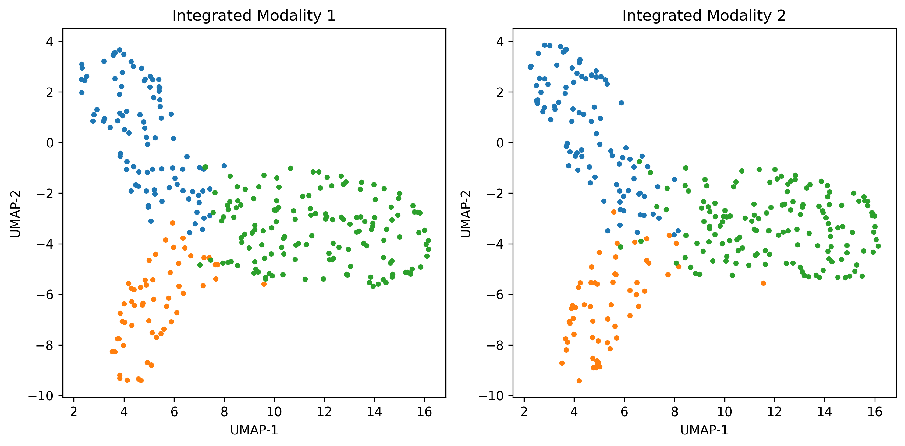
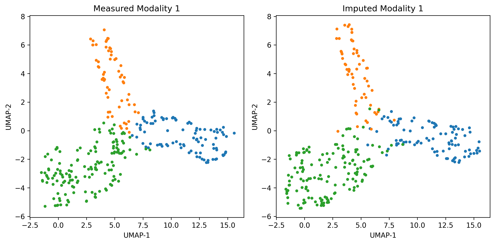

# JAMIE: Joint Variational Autoencoders for Multi-Modal Imputation and Embedding

Single-cell multi-modal datasets have emerged to measure various characteristics of individual cells, enabling a deep understanding of cellular and molecular mechanisms. However, generating multi-modal data for many cells remains costly and challenging. Thus, missing modalities happens frequently, becoming a major obstacle to understanding mechanisms. Recently, machine learning approaches have been developed to impute cell data but typically use fully matched multi-modal data and learn common latent embeddings that potentially miss modality specificity. To address these issues, we developed a novel machine learning model with open-source tool, Joint variational Autoencoders for Multi-modal Imputation and Embedding (JAMIE). JAMIE takes single-cell multi-modal data that can have partially matched samples across modalities. Variational autoencoders learn the latent embeddings of each modality. Then, embeddings from matched samples across modalities are aggregated to identify joint cross-modal latent embeddings before reconstruction. To perform cross-modal imputation from one to another, the latent embeddings can be used with the opposite decoder.

This library houses `JAMIE` along with several utility functions that aid in the evaluation of multi-modal integration and imputation techniques.  Paper figures are generated in `examples/notebooks` and source data can be found in `examples/data`.

## Installation Instructions
First, clone and enter the repository
```bash
git clone <JAMIE-github-link>
cd JAMIE
```

Create and activate a virtual environment using python 3.9 with `virtualenv` or `conda`,
```python
# virtualenv (python 3.9)
virtualenv env
source env/bin/activate

# conda
conda create -n JAMIE python=3.9
conda activate JAMIE
```

Install dependencies with `pip`
```bash
# For general usage
pip install -r requirements.txt

# For example notebooks or development
pip install -r requirements-dev.txt
```

Install the local library using `pip`
```bash
pip install -e .
```

## Example: Simulation Data
Load two data matrices with an optional prior correspondence matrix.
```python
import numpy as np

data1 = np.loadtxt("../data/Unioncom/MMD/s1_mapped1.txt")
data2 = np.loadtxt("../data/Unioncom/MMD/s1_mapped2.txt")
# JAMIE will assume matrices with the same number of rows are
# completely matched if not provided a correspondence matrix
corr = np.eye(data1.shape[0], data2.shape[0])
```

Create the `JAMIE` instance and integrate the datasets.
```python
from jamie import JAMIE

jm = JAMIE()
integrated_data = jm.fit_transform(dataset=[data1, data2], P=corr)
```

Several arguments may be passed to `JAMIE`, including:
- `output_dim`: The number of latent features
- `epoch_dnn`: Maximum number of epochs
- `batch_size`: Batch size
- `pca_dim`: If `None`, does not perform PCA.  Otherwise, takes an array of length 2 detailing the number of principal components to use while processing each input dataset
- `use_early_stop`: If `True`, uses early stopping algorithm
- `min_epochs`: Number of epochs before early stopping can take effect
- `dropout`: Amount of dropout in JAMIE model.  Generally should be `0` for pure integration models and `0.6` (default) for everything else
- `debug`: Print individual loss values

The model can be saved in an `h5` file format
```python
# Save model
jm.save_model('simulation_model.h5')

# Load model
# jm.load_model('simulation_model.h5')
```

The trained `JAMIE` model may be reused on other datasets of the same modalities
```python
data3 = ...
data4 = ...
new_integrated_data = jm.transform(dataset=[data3, data4])
```

Additionally, the trained model can be used for imputation
```python
data1_imputed = jm.modal_predict(data2, 1)
data2_imputed = jm.modal_predict(data1, 0)
# data3_imputed = jm.modal_predict(data4, 1)
# data4_imputed = jm.modal_predict(data3, 0)
```

For visualization, `JAMIE` includes `plot_integrated`, which uses `UMAP` to preview integrated or imputed data.
```python
import matplotlib.pyplot as plt
from jamie.evaluation import plot_integrated

# Load cell-type labels
type1 = np.loadtxt("../data/Unioncom/MMD/s1_type1.txt").astype(np.int)
type2 = np.loadtxt("../data/Unioncom/MMD/s1_type2.txt").astype(np.int)
type1 = np.array([f'Cell Type {i}' for i in type1])
type2 = np.array([f'Cell Type {i}' for i in type2])

# Visualize integrated latent spaces
fig = plt.figure(figsize=(10, 5))
plot_integrated(integrated_data, [type1, type2], ['Modality 1', 'Modality 2'], legend=True)
plt.tight_layout()
plt.savefig('../../img/simulation_integrated.png', dpi=300, bbox_inches='tight')
```



```python
# Visualize imputed data
from jamie.evaluation import plot_regular

fig = plt.figure(figsize=(10, 5))
plot_integrated([data1, data1_imputed], [type1, type1], ['Measured Modality 1', 'Imputed Modality 1'])
plt.tight_layout()
plt.savefig('../../img/simulation_imputed.png', dpi=300, bbox_inches='tight')
```



More details on included plotting functions can be found in `examples/notebooks`.
